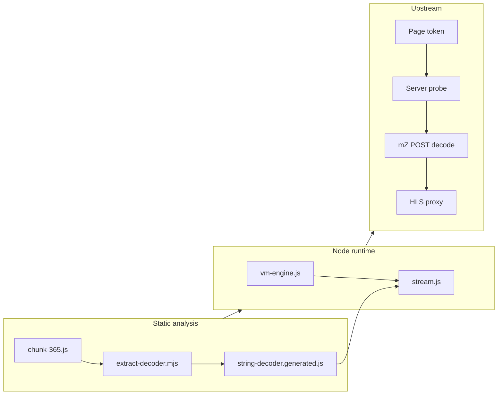

# vidfast-pro

Obfuscated client-side JavaScript guards stream discovery on a third-party embed player. This repository is the recovered pipeline: string deobfuscation from a webpack chunk, headless execution of the vendor VM in Node, parallel upstream probing, and an HLS rewrite proxy for local validation.

## Problem class

Typical embed stream protection stacks combine:

- **Chunk isolation** — `mf` / `mZ` logic in a numbered bundle (`assets/chunk-365.js`), not the entry script.
- **String tables** — path segments resolved through rotated decoders (`i3`, `i5`, `i7`).
- **Environment gates** — headless, worker, and frame checks before server lists or decode URLs are returned.
- **HLS upstream** — `.m3u8` responses with relative segments and non-standard MPEG-TS framing (PNG-wrapped sync).

## Pipeline

| Step | Action | Output |
| --- | --- | --- |
| Static extract | Boundaries for decoder functions + rotation IIFE in chunk 365 | `tools/extract-decoder.mjs` → `lib/string-decoder.generated.js` |
| Path rebuild | `decodeString` indices for content and stream prefixes | `lib/content-path.js` |
| VM slice | Cut `mf`/`mZ` region; patch `mV`/`mA`/`mU`, crypto and DOM shims | `lib/chunk-patches.js`, `lib/vm-engine.js` |
| Headless run | `createVmRuntime()` via `new Function` with `fetch` / `Worker` stubs | `runServers`, `runDecode` |
| Probe | Concurrent POST on each server `data` slug | `probeAvailableServers()` |
| Playback | Manifest line rewrite; strip IEND prefix before `0x47` | `lib/hls-proxy.js` |

## Architecture



## Layout

```
lib/
  vm-engine.js
  chunk-patches.js
  stream.js
  content-path.js
  hls-proxy.js
  constants.js

tools/
  extract-decoder.mjs
  resolve-stream.mjs

assets/chunk-365.js
server.mjs
public/index.html
```

## VM hosting

The extracted slice keeps vendor `mf` and `mZ` intact. Patches short-circuit sandbox heuristics (`mV`, `mA`, `mU`) and supply `crypto.randomBytes`, `Worker`, and minimal `document` / `location` so `runServers(en)` and `runDecode(responseText)` match browser behavior without a full DOM.

## HLS proxy

`/api/hls` rewrites non-comment playlist lines to absolute proxy URLs. Segment bodies may embed TS after a PNG `IEND` block; the proxy scans for the transport sync byte before forwarding.

## Usage

Node 18+.

```bash
npm run extract-decoder
npm run resolve
npm start
```

```bash
node tools/resolve-stream.mjs 1265609
node tools/resolve-stream.mjs tv 95396 1 1
```

```bash
VIDFAST_ORIGIN=https://www.vidfast.net npm run resolve
```

| Endpoint | Role |
| --- | --- |
| `GET /api/stream?id=&type=movie` | Full resolve |
| `GET /api/stream?id=&season=&episode=` | TV resolve |
| `POST /api/server` | Decode one server `data` blob |
| `GET /api/hls?url=` | Proxied manifest / segment |

## Scope

Authorized analysis and local testing only. Not intended to bypass access controls or third-party terms of service.
